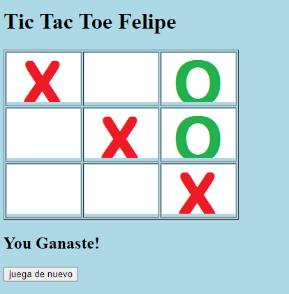

# TicTacToe

Este es un proyecto de juego de TicTacToe desarrollado en Java.

## Descripción

El juego de TicTacToe, también conocido como tres en raya, es un juego clásico de dos jugadores donde uno utiliza fichas con una marca "X" y el otro con una marca "O". El objetivo es completar una línea horizontal, vertical o diagonal con tres marcas iguales antes que el oponente y ganarle.

## Ejemplo de imagen

